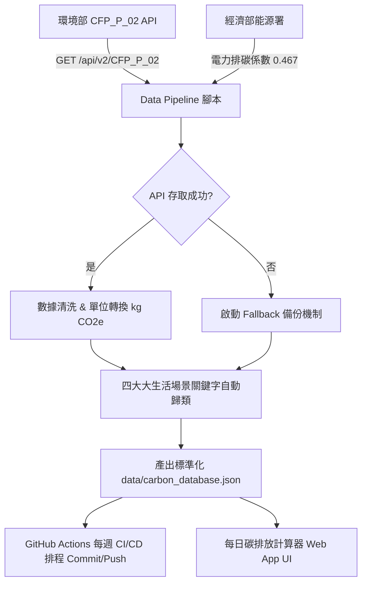

# 🌿 每日碳排放計算器 (Daily Carbon Footprint Calculator)

> 專業級台灣官方開放資料動態 Data Pipeline 與自動化 JSON 數據庫建置專案。


---

## 📌 專案簡介 (Project Overview)

本專案旨在將台灣官方開放資料庫（環境部氣候變遷署與經濟部能源署）動態介接，建置標準化、高可用性的碳足跡排放數據庫 (`carbon_database.json`)。

提供自動化 Python/Node.js 資料管線 (Data Pipeline) 與 GitHub Actions CI/CD 排程，每週自動同步官方最新數據，並內建質感 UI 每日碳排放計算器與數據監控介面。

---

## 🏛️ 架構與資料管線 flow (Pipeline Architecture)



---

## 🔌 官方開放資料介接規範 (Data Ingestion Specs)

### 1. 環境部氣候變遷署 - 產品碳足跡排放係數 (CFP_P_02)
- **API Endpoint**: `https://data.moenv.gov.tw/api/v2/CFP_P_02`
- **授權機制**: 支援 `MOENV_API_KEY` (可在開放資料平台免費申請)
- **解析欄位對照**:
  | 官方原始欄位 | 數據庫標準欄位 | 說明與轉換 |
  | :--- | :--- | :--- |
  | `passport_name` / `name` / `產品名稱` | `name` | 產品或活動名稱 |
  | `coe` / `carbon_footprint_coe` / `碳足跡數值` | `coe` | 碳排放係數 (數值) |
  | `unit` / `carbon_footprint_unit` / `單位` | `unit` | 計量單位 (標準化為 kg CO2e) |
  | `announcement_date` / `審查通過日期` | `review_date` | 審查通過/公告日期 |
  | `statement_no` / `聲明書號` | `statement_no` | 官方聲明書編號 |
  | `company_name` / `廠商名稱` | `company` | 申請公司或機構 |

### 2. 經濟部能源署 - 電力排碳係數
- **最新公告數值**: `0.467` kg CO2e / 度 (kWh)
- **歷史數據支援**: 內建 2020 ~ 2024 年歷史係數表，支援動態帶入計算。

---

## 🧹 數據清洗與四大大生活場景自動歸類 (Data Normalization & Categorization)

所有抓取之係數皆會經過以下自動化演算法處理：

1. **單位標準化 (Unit Normalization)**:
   - 若原始單位包含 `g CO2e`，自動除以 1000 轉換為標準 `kg CO2e`。
2. **自動分類矩陣 (Auto Categorization)**:
   - **🚗 交通運輸 (`transportation`)**: 高鐵、捷運、台鐵、公車、機車、汽車、飛機、汽柴油里程等。
   - **🍱 飲食習慣 (`food`)**: 白米、鮮乳、咖啡、豆腐、便當、肉類、蔬果、包裝水等。
   - **⚡ 居家能源 (`energy`)**: 台灣電力 (0.467)、自來水、天然氣、桶裝瓦斯等。
   - **♻️ 消費與廢棄物 (`waste_consumption`)**: 影印紙、衛生紙、寶特瓶回收、垃圾焚化處理、日用品等。
3. **後備備份機制 (Fallback Mechanism)**:
   - 若官方 API 伺服器異常或斷網，腳本會自動切換載入高可用 seed dataset，確保前端計算器與數據庫永遠可用，服務不中斷。

---

## 📁 專案目錄結構 (Project Directory)

```
daily-carbon-calculator/
├── .github/
│   └── workflows/
│       └── sync_data.yml        # GitHub Actions 每週自動同步 CI/CD
├── scripts/
│   ├── fetch_official_data.py   # Python 資料管線主程式 (預設)
│   └── fetch_official_data.js   # Node.js 資料管線主程式 (備選)
├── data/
│   └── carbon_database.json     # 標準化碳排放 JSON 數據庫
├── web/
│   ├── index.html               # 每日碳排放計算器與監控 Web UI
│   ├── styles.css               # 現代質感樣式 (Dark Mode, Responsive)
│   └── app.js                   # 碳排放計算邏輯與 UI 互動腳本
├── .env.example                 # 環境變數範例檔
├── .gitignore                   # Git 忽略設定
├── requirements.txt             # Python 依賴需求 (requests)
├── setup_git.ps1                # Windows PowerShell Git 一鍵部署腳本
├── setup_git.sh                 # Linux/Mac Git 一鍵部署腳本
└── README.md                    # 專案說明文件
```

---

## 💻 本地執行指南 (Local Quick Start)

### 1. 使用 Python 執行資料管線
```bash
# 安裝需求套件
pip install -r requirements.txt

# 帶入 API Key 執行管線 (也可在 .env 中設定 MOENV_API_KEY)
python scripts/fetch_official_data.py --api-key "YOUR_API_KEY"

# 強制測試 Fallback 模式
python scripts/fetch_official_data.py --force-fallback
```

### 2. 使用 Node.js 執行資料管線
```bash
node scripts/fetch_official_data.js
```

### 3. 開啟 Web 視覺化碳排放計算器
直接用瀏覽器開啟 `web/index.html` 即可使用每日碳足跡計算、係數檢索與數據庫監控功能。

---

## 🚀 部署至 GitHub 與 CI/CD 設定

### 第一步：在 GitHub 建立 Repository
1. 至 GitHub 點擊 **New Repository**，名稱輸入 `daily-carbon-calculator`。
2. 保持 repo 為 Public 或 Private。

### 第二步：一鍵 Git 初始化與首次推送到 GitHub

#### Windows (PowerShell):
```powershell
.\setup_git.ps1 -RepoUrl "https://github.com/YOUR_USERNAME/daily-carbon-calculator.git"
```

#### Linux / Mac / Git Bash:
```bash
chmod +x setup_git.sh
./setup_git.sh "https://github.com/YOUR_USERNAME/daily-carbon-calculator.git"
```

#### 手動 Bash 命令 sequence:
```bash
git init
git branch -M main
git add .
git commit -m "feat: 🌿 initialize daily carbon footprint calculator data pipeline"
git remote add origin https://github.com/YOUR_USERNAME/daily-carbon-calculator.git
git push -u origin main
```

### 第三步：設定 GitHub Actions 密鑰 (API Key)
1. 在 GitHub 倉庫頁面進入 **Settings** -> **Secrets and variables** -> **Actions**。
2. 點擊 **New repository secret**。
3. Name 輸入 `MOENV_API_KEY`，Value 貼上您的環境部 API Key。
4. 儲存後，GitHub Actions 每週一 00:00 (UTC) 都會自動執行 `.github/workflows/sync_data.yml` 抓取最新數據並寫回倉庫！

---

## 📄 授權 (License)

本專案基於 MIT 授權條款開放，官方開放資料來源著作權歸屬於台灣政府環境部與經濟部能源署。
